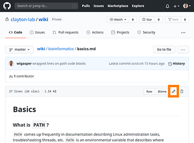

# Using the wiki

This is not a permanent solution and is more just a collection of markdown files 
than it is a formal wiki with a traditional wiki structure and user interface.
This is temporary so we can get started with documentation, as generating documentation
after the fact is often more tedious than just doing it right away.

## Editing the wiki

Everyone is encouraged to contribute to the wiki in order to help create a central 
knowledge base for the lab. 

This wiki uses Github-flavored-markdown, and a very nice cheat sheet is available 
[here](https://github.com/adam-p/markdown-here/wiki/Markdown-Cheatsheet). Markdown 
is great in that it allows users to easily define how text should look in a reproducible
way, in plain text.

If you are familiar with git, you may prefer to clone the repo, create a working branch, 
and then submit a pull request. It is okay to commit directly to the master branch if 
you need to, but it is *highly* encouraged to create a new branch, commit changes, and 
then open a pull request. This makes it much easier to manage changes coming from 
multiple users and ensures that accidental changes aren't made to the master branch.

### Modifying a page using the web platform

First, navigate to the page you want to edit. Then, click the pencil in the upper right
hand corner of the markdown block:

Make any changes that you want, provide a commit message (this can be the default message
or some simple description), and then click the radio button that says `Create a new 
branch for this commit and start a pull request`:

Enter a branch name if you want, or use the default, then click the `Propose changes`
button.
